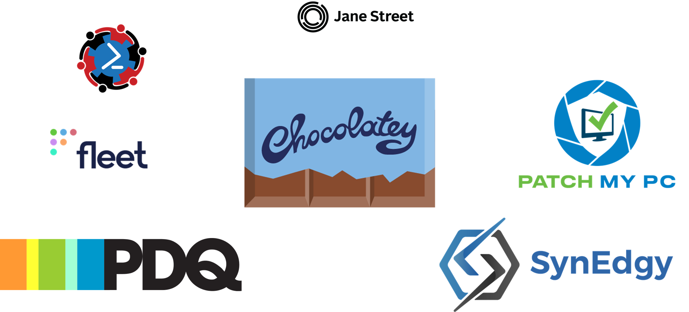

<!-- _class: title -->
# Cross-Cloud without Crossed Fingers

## Surviving Azure, AWS, and GCP with PowerShell

<p class="name">Adil Leghari</p>
<p class="handle">@adilio · Wiz</p>

<!--
[Lights. Walk on. Slide 1 — Title.]

All right. Thanks for being here.

This is a talk about three cloud providers, one keyboard, and the specific feeling of typing a command and realizing halfway through that you have no idea which cloud you're actually in.

I'm Adil. I work at Wiz on the solutions engineering side. Before that I did a long stretch of PowerShell and sysadmin work — some of it in environments where you find out at 2am, not before, that you were supposed to know all three of these clouds. That was the talk I almost gave, five years ago. It would have been worse. Now it's a module, and it's this.
-->

---

<!-- _class: no_background -->
# Thank You



<!--
[Advance to Slide 2 — Thank You.]

Before anything else — thank you to the PowerShell + DevOps Summit team and to every sponsor on this slide. This week exists because of them. None of us would be in this room otherwise.

[Beat.] OK. Back to the terminal.
-->

---

# The Frozen Terminal

```

PS /prod> Get-AzVM -ResourceGroupName "rg-west-us" -Name "AdilVM"


```

*The five-second pause.*

<!--
[Advance to Slide 3 — The Frozen Terminal.]

Look at that command. Clean Azure PowerShell. `Get-AzVM`, resource group, VM name. Nothing technically wrong with it.

Except I ran it in CloudShell.

[Beat.]

AWS CloudShell. [laugh beat]

That's the moment. You're halfway through a command, you're staring at what you just typed, and you suddenly realize the terminal you're in and the command you just typed belong to two different clouds entirely. And for about five seconds you just — stop. You don't know which cloud you're in anymore. You're not even sure which cloud the command thinks it's in.

That was me. It's still me, sometimes. I once spent ten minutes debugging a `gcloud` command that wasn't working, and it wasn't working because it was an `az` command. [laugh beat] I was bouncing between these three clouds, and I didn't feel like I was learning one big system. I felt like I was renting three different brains, and one of them was always offline.

So I reached for the one tool my hands already trusted.
-->

---

# It's Not You

The clouds disagree on what a thing *is*.

| AWS | Azure | GCP |
|---|---|---|
| Policy documents | Role assignments | IAM bindings |

Same question. Three different grammars. IAM is just the loudest example.

<!--
[Advance to Slide 4 — It's Not You.]

Before we get into the module, one thing I want to say out loud, because it gets left out of a lot of multi-cloud talks.

Multi-cloud is hard for a reason, and the reason is not that you are bad at it.

These three clouds were not designed to coexist in one person's head. They were designed independently, by different companies, at different times, with different first customers and different very-reasonable answers to very-fundamental questions. *What is a resource? How is it scoped? Who owns it? How do you grant someone access to it?* Each of these clouds answered those questions carefully — and separately.

That is not a criticism of any of them. It's what happens when three excellent teams solve the same problem in parallel. All three of those teams are, statistically, in this room. [laugh beat] I'm not throwing anybody under a bus today. The bus is the problem space itself.

The loudest example is identity. AWS expresses access as policy documents. Azure expresses access as role assignments scoped to a hierarchy. GCP expresses access as bindings. Those three approaches are not the same idea wearing different clothes. They are three different grammars for the same English sentence — *"who can do what to this thing?"*

Hold that example in your head. I'm coming back to it in about fifteen minutes, because it turns out to be the single most important slide in this talk. And not for the reason you probably think right now.
-->

---

<!-- _class: no_background -->
# Fluency is the Anchor

<div class="callout primary">
  <h3>Build on what does not move. </h3>
</div>

<!--
[Advance to Slide 5 — Fluency is Infrastructure.]

So if the systems don't agree, I want an anchor that does.

For me, that anchor was PowerShell. Not because PowerShell is objectively best — I don't believe in "objectively best" for any tool. [laugh beat] If you use bash, we're still friends. If you use Python, still friends. If you've quietly written your own CLI in Rust because you don't trust anybody's tooling, we are *especially* still friends.

PowerShell is just the tool I'm most fluent in. My hands already know the shape: verb-noun, pipeline, object out. The cognitive cost of a PowerShell command is, for me, close to zero. That's what I wanted for cross-cloud work. Not the best tool on paper. The *fluent* tool in my hands.

That's the bet the rest of this talk is about. When the systems underneath you don't hold still, you build on the thing that does. For me, that's PowerShell. For you, it could be something else. The idea travels. Fluency is infrastructure.
-->

---

# PSCumulus

A thin, honest abstraction for Azure, AWS, and GCP.

```text
Connect-Cloud          Get-CloudInstance      Start-CloudInstance
Disconnect-Cloud       Get-CloudStorage       Stop-CloudInstance
Get-CloudContext       Get-CloudDisk
                       Get-CloudNetwork
                       Get-CloudFunction
                       Get-CloudTag
```

Same verbs. Same nouns. Same output shape. No pretending the providers are identical.

<!--
[Advance to Slide 6 — PSCumulus.]

So here's the module. It's called PSCumulus — because I needed a name, "cumulus" was the only cloud word nobody had taken, and "PS" is how every PowerShell module legally has to start. [laugh beat] I know.

Eleven public commands. Deliberately small. The first version had about twenty, and I cut half of them, and the half I cut turned out to be more of this talk than the half that's left.

Two things to flag before we look at code.

First: the noun is always `Cloud<Thing>`. Never `Az`. Never `EC2`. Never `GCP`. The public noun is a normalized concept. The native type still lives in metadata, because it still exists, and pretending it doesn't would be worse.

Second: every read command returns the same output shape, regardless of which cloud it hit. That's the whole bet. Let me show you.
-->

---

# [DEMO] Native vs. Unified

```powershell
# Native
Get-AzVM
Get-EC2Instance
gcloud compute instances list --format=json

# Unified
Connect-Cloud     -Provider AWS, Azure, GCP
Get-CloudContext
Get-CloudInstance -Provider Azure -ResourceGroup prod-rg
Get-CloudInstance -Provider AWS   -Region us-east-1
Get-CloudInstance -Provider GCP   -Project contoso-prod
```

<!--
[Advance to Slide 7 — Demo A. Switch to terminal.]

The three commands on the left — `Get-AzVM`, `Get-EC2Instance`, `gcloud compute instances list --format=json`. All three answer the same human question: *what compute do I have here?* All three answer it in completely different output shapes, with completely different authentication states behind them, stored in completely different config locations on my disk. [laugh beat]

I'm not going to run them. You know what they do. You know what you *don't* know? What the same question looks like when it doesn't care which cloud it's in.

[Run: `Connect-Cloud -Provider AWS, Azure, GCP`]

One call, three providers. Under the hood, this checks each provider for an existing session and triggers the native login if there isn't one. That's still three login flows — I can't fix that with a module, those aren't mine to fix. What I *can* do is stop making you remember which one is which.

And critically, the contexts live side by side. Connecting to AWS does not log you out of Azure. This is a small thing, and I once lost an afternoon to it, so here we are.

[Run: `Get-CloudContext`]

Three providers. Each with an account, a scope, a region. All active. Every column means the same thing in every row. That matters more than it sounds like it should.

[Run: `Get-CloudInstance -Provider Azure -ResourceGroup prod-rg`]

Azure instances. Name, Provider, Region, Status, Size, CreatedAt. Look at the shape.

[Run: `Get-CloudInstance -Provider AWS -Region us-east-1`]

Same command, AWS. Same shape.

[Run: `Get-CloudInstance -Provider GCP -Project contoso-prod`]

GCP. Same shape. The output doesn't know which cloud it came from until you look at the Provider column.

That's the whole move.
-->

---

# [DEMO] One Pipe, Three Clouds

```powershell
Get-CloudInstance -All |
  Where-Object { -not $_.Tags['owner'] } |
  Format-Table Name, Provider, Region -AutoSize
```

Untagged production assets across every connected cloud.
One pipeline. Three providers. One output shape to filter against.

<!--
[Advance to Slide 8 — Demo B.]

Now the thing that actually justified building the whole module. If nothing else lands in this talk, this is the one.

[Run: `Get-CloudInstance -All`]

That flag — `-All` — iterates every provider that has a stored context, calls each backend, and streams one pipeline of `CloudRecord` objects. I'm not writing three loops. I'm not merging three output shapes with `Select-Object` gymnastics. I'm just getting one stream of objects.

And once you have one stream, you can do this.

[Run:
Get-CloudInstance -All |
  Where-Object { -not $_.Tags['owner'] } |
  Format-Table Name, Provider, Region -AutoSize
]

That is *"find me the untagged production assets across every cloud I'm currently connected to,"* in three lines, across three cloud providers. The tag key `owner` works the same whether the source was an AWS tag, an Azure tag, or a GCP label. That normalization is the whole game.

The first time this worked end to end, I stared at it for about a minute. Then I ran it again, because I was pretty sure I was hallucinating. [laugh beat]

[Run: `Show-FleetHealth` or `Get-CloudInstance -All | Group-Object Provider`]

And this is the part I care about most. This isn't one trick. The `CloudRecord` shape composes into any pipeline you already know how to write. `Group-Object`. `Sort-Object`. `Where-Object`. `Select-Object`. The mental model is PowerShell, which you already have. The data is multi-cloud, which you didn't used to.
-->

---

# The Shared Shape

`PSCumulus.CloudRecord`

| Name | Provider | Region | Status | Size | CreatedAt | Tags | Metadata |
|---|---|---|---|---|---|---|---|
| web-01 | Azure | eastus | Running | Standard_B2s | 2026-03-01 | {env:prod} | … |
| api-01 | AWS | us-east-1 | Running | t3.small | 2026-02-18 | {env:prod} | … |
| worker-01 | GCP | us-central1-a | Running | e2-medium | 2026-03-10 | {env:prod} | … |

Seven safe columns. One honest `Metadata` property for everything else.

<!--
[Back to slides. Advance to Slide 9 — The Shared Shape.]

That shape has a name. `PSCumulus.CloudRecord`. Eight fields: Name, Provider, Region, Status, Size, CreatedAt, Tags, Metadata.

Seven of those are the fields you can safely filter and group against across clouds, because all three providers have a coherent answer for them. The eighth — Metadata — is where the honest provider-native stuff lives. Your Azure resource group. Your AWS VPC ID. Your GCP zone. Those are real, they're not lies, they just don't belong in the first seven columns because they don't exist in all three clouds. Promoting them there would be a lie.

The trick with this kind of abstraction isn't deciding what to include. It's deciding what to leave in Metadata without apologizing for it.
-->

---

# Why the Name Matters

- `Get-CloudInstance` ← public abstraction
- ~~`Get-VM`~~ ← already owned by Hyper-V
- ~~`Get-AzureInstance` / `Get-EC2Instance` / `Get-GCPInstance`~~ ← provider marketing

<!--
[Advance to Slide 10 — Why the Name Matters.]

Quick aside on the naming, because someone always asks.

I picked `Get-CloudInstance`, not `Get-VM`. Two reasons.

First: `Get-VM` is already owned by the Hyper-V world in PowerShell, and it has been for a long time. I was not going to have this module walk in and pretend it owned that noun. Too many people have muscle memory there, and some of them, again, are in this room.

Second: the public noun is a normalized *cloud* concept, not a vendor name. `CloudInstance` tells the truth about what the abstraction is. If I named it `Get-AzureInstance`, I'd be implying Azure was the main character. It isn't. Same for AWS, same for GCP. Nobody's the main character — that's the shape of the bet.

I had that argument with myself for about ten minutes in a text editor with no other humans present. [laugh beat] Then I called it `Get-CloudInstance` and got on with my life.
-->

---

<!-- _class: dense -->
# What Earns a Unified Command

| Resource | Azure | AWS | GCP | PSCumulus |
|---|---|---|---|---|
| Compute | `Get-AzVM` | `Get-EC2Instance` | `gcloud compute instances list` | `Get-CloudInstance` |
| Storage | `Get-AzStorageAccount` | `Get-S3Bucket` | `gcloud storage ls` | `Get-CloudStorage` |
| Disk | `Get-AzDisk` | `Get-EC2Volume` | `gcloud compute disks list` | `Get-CloudDisk` |
| Network | `Get-AzVirtualNetwork` | `Get-EC2Vpc` | `gcloud compute networks list` | `Get-CloudNetwork` |
| Functions | `Get-AzFunctionApp` | `Get-LMFunctionList` | `gcloud functions list` | `Get-CloudFunction` |
| Tags | `Get-AzTag` | `Get-EC2Tag` | `gcloud resource-manager tags` | `Get-CloudTag` |
| **IAM** | `Get-AzRoleAssignment` | `Get-IAMPolicy` | `gcloud projects get-iam-policy` | **—** |

The test: do the underlying philosophies overlap enough that a normalized answer is still honest?

<!--
[Advance to Slide 11 — What Earns a Unified Command.]

OK. This is the real content of the talk. If you only take one slide home, this is it.

Every command in PSCumulus had to pass a single test: *do the underlying cloud philosophies behind this concept overlap enough that a normalized answer is still honest?*

For compute — yes. All three clouds agree that a compute instance is a thing that runs, has a name, lives in a region, has a size, has a status. The philosophies align. `Get-CloudInstance` exists.

For storage — yes, with seams. Billing models differ, lifecycle policies differ, consistency guarantees differ. But the operator-level question, *what storage exists here*, translates. `Get-CloudStorage` exists.

For disks, networks, functions, tags — same story. Increasing amounts of seam showing at the edges, but the core concept is close enough that normalizing isn't lying. Those commands exist.

Now look at the last row. IAM. There's a dash where a PSCumulus command would be.

The human question — *who has access, and what can they do?* — is the same across all three clouds. But the answer can't be normalized. The underlying philosophies don't overlap.

That dash is not an omission. That dash is load-bearing.
-->

---

# Why the Dash Is the Point

- **AWS** → policy documents *(JSON, attached to principals)*
- **Azure** → role assignments *(hierarchical, inherited)*
- **GCP** → IAM bindings *(resource-scoped, member + role)*

<div class="callout tertiary">
  If the normalized object would be mostly <code>Metadata</code>,
  the abstraction is too weak to deserve a first-class command.
</div>

<!--
[Advance to Slide 12 — Why the Dash Is the Point.]

Let me make the IAM thing concrete, because this is the part that sells me on the discipline.

All three of these are coherent on their own. Each is the right answer to the problem the team in front of it was solving. I'm not here to tell you any of them is wrong. I'm genuinely impressed by all three of them. They just don't compose.

AWS expresses access as policy documents. JSON objects declaring what actions are allowed or denied on what resources, attached to users, groups, or roles. Policy-first.

Azure expresses access as role assignments. A principal bound to a named role at a specific scope in a resource hierarchy, inherited downward through management groups, subscriptions, resource groups. Hierarchy-first.

GCP expresses access as bindings on a resource. Member and role pairs, sometimes conditional, attached at the resource level. Resource-first.

Different scoping. Different inheritance. Different mental models. Three good answers to the same question, each correct in its own grammar, none of them translatable into the others without losing information that actually matters.

If I wrote `Get-CloudPermission` anyway, one of two bad things would happen. Either I'd flatten everything to the least common denominator, and lose the scoping and inheritance that make the answer useful in the first place. Or I'd stuff the real answer into Metadata, and the top-level object would be this sincere, friendly wrapper with almost nothing in it. [laugh beat] Either way I'd be lying — just with different body language.

So there's a rule I use for decisions like this. *If the normalized object would be mostly Metadata, the abstraction is too weak to deserve a first-class command.* That's why there is no `Get-CloudPermission`. Instead, three explicit provider-native commands — `Get-AzureRoleAssignment`, `Get-AWSPolicyAttachment`, `Get-GCPIAMBinding`. Three seams, left visible, on purpose.

I think this is the actual skill of this kind of work. Knowing when *not* to abstract is harder than knowing when to. Because when you don't abstract, the slide looks empty, and you have to defend the empty space. [laugh beat] That empty space is a feature. The module is useful because it refuses to lie about the places where the clouds are genuinely, philosophically different.
-->

---

# Not Terraform's Job

<div class="callout secondary">
  <h3>Terraform — desired state, provisioning, lifecycle</h3>
  <h3>PSCumulus — operator intent, interactive querying, shared shape</h3>
</div>

Different layer. Not opposition.

<!--
[Advance to Slide 13 — Not Terraform's Job.]

Somebody is thinking it, so let's get it out of the way. *Why not Terraform?*

Terraform's great. I use Terraform. Terraform solves a different problem.

Terraform standardizes *infrastructure* — what exists, in what shape, managed as code. Desired state, provisioning, drift correction. PSCumulus standardizes *how a human interacts with* infrastructure once it already exists. An operational shell with consistent ergonomics across three clouds.

Terraform is not an operational shell. PSCumulus is deliberately behaving like one. Different layer. Not opposition. If your question is *"what should exist,"* reach for Terraform. If your question is *"what does exist, what shape is it in right now, and can I filter it before I have to page somebody"* — that's the shell, and that's where this lives.
-->

---

# What This Does Not Do

<div class="primary-list">

- No cost surface
- No unified health / status surface
- No write commands for most inventory queries
- No cross-cloud search-by-name
- No IAM

</div>

<!--
[Advance to Slide 14 — What This Does Not Do.]

Before I land this, let me name what PSCumulus doesn't do. The people most likely to ask these questions deserve a straight answer, and I would rather say it on stage than leave it for a GitHub issue that gets filed at 11pm tonight.

There's no cost surface. Cost across these three clouds is its own multi-hour talk, and it is not this one. [laugh beat]

There's no unified health or status surface. The provider status signals are shaped too differently to compose honestly.

The module is read-oriented. Most inventory queries do not have corresponding write commands. The ones that do — `Start-CloudInstance` and `Stop-CloudInstance` — are on the roadmap to gain `-WhatIf` support. They should already have it. That one is on me.

There's no cross-cloud search by name. And there's no IAM, for the reasons we just spent five minutes on.

Some of those are roadmap. Some are deliberate. None of them are hidden. Gaps named are gaps owned.
-->

---

<!-- _class: no_background -->
# The Lens

<div class="callout gradient">
  What is the tool you will still trust when the job gets weird?
</div>

<!--
[Advance to Slide 15 — The Lens.]

I want to leave you with something that isn't a summary.

We spend a lot of time in this field asking what the *right* tool is for a given job. It's a good question, and I don't want to talk anybody out of it. But there's another question I think about more now.

*What's the tool you will still trust when the job gets weird?*

When you're on call and the environment is half-configured and you cannot remember which cloud you're supposed to be in. When you need to move fast and you genuinely cannot afford a mistake, and you need your hands to already know what to do without you looking anything up.

Those are the moments where fluency matters more than optimality. And fluency is built over time, on tools you already know.

For me, that tool was PowerShell. The module you just saw is just the map I drew on top of it, with the places marked where the terrain stops cooperating. I hope some of it is useful to you. And if the only thing that travels back home is the *question* — what's the tool you'll still trust when the job gets weird — that's fine with me too.
-->

---

<!-- _class: title -->
# github.com/adilio/PSCumulus

<p class="handle">@adilio · Wiz</p>

*Slides and talk track linked in the repo. Thanks.*

<div class="qr-block">

<div class="qr-item">


<p class="qr-caption">Install-Module PSCumulus</p>

</div>

<div class="qr-item">


<p class="qr-caption">github.com/adilio/PSCumulus</p>

</div>

</div>

<!--
[Advance to Slide 16 — Repo.]

Repo's at `github.com/adilio/PSCumulus`. Slides and the talk track are in there too, so you don't have to photograph anything. Thanks for listening.

[End.]
-->
